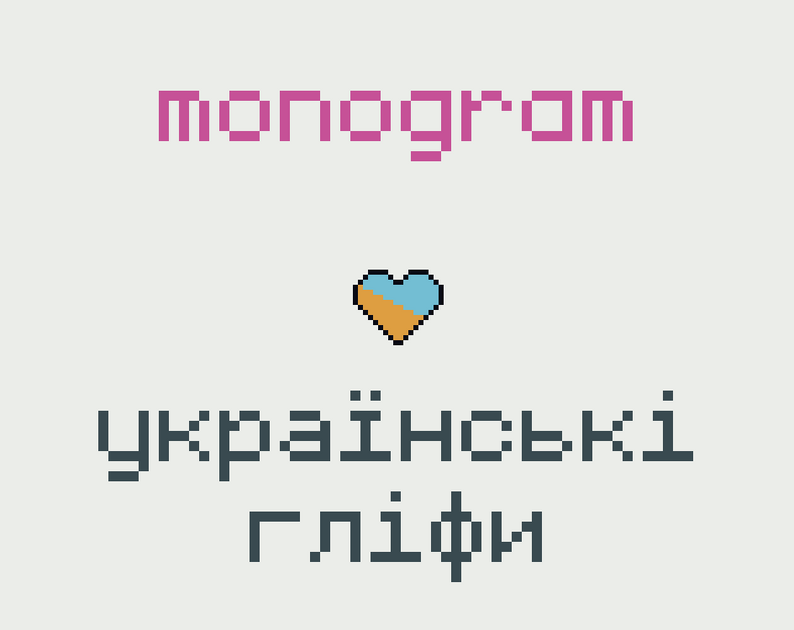
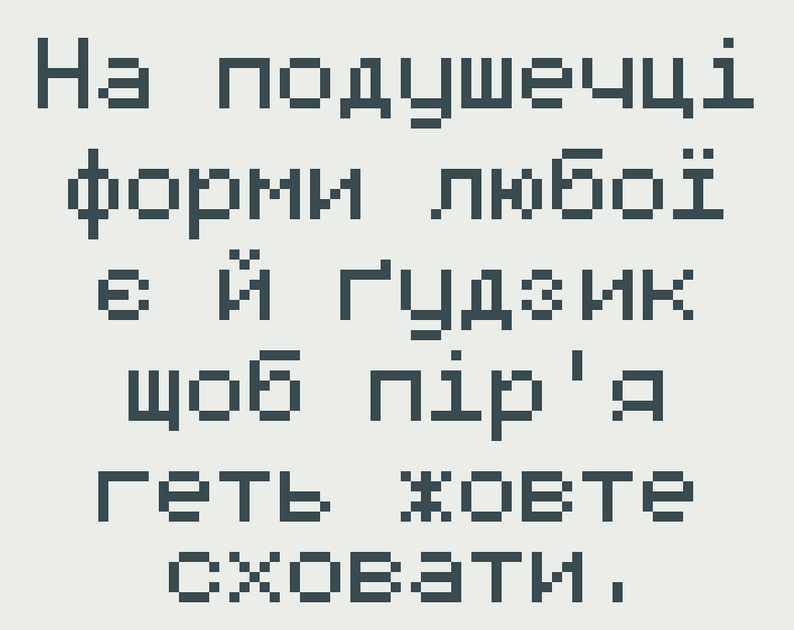

# Monogram UA

A fork of [monogram](https://datagoblin.itch.io/monogram) font, originally made by [Vinícius Menézio](https://datagoblin.itch.io/). This fork adds Ukrainian alphabet characters to monogram-extended font.

Also available to download on [itch.io](https://dmitriy-shmilo.itch.io/monogram-ua).
